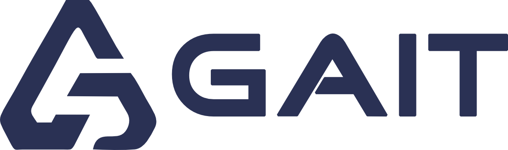

<picture>
  <source media="(prefers-color-scheme: dark)" srcset="assets/gait-logo-white.png">
  <source media="(prefers-color-scheme: light)" srcset="assets/gait-logo-navy.png">
  
</picture>

### AI Solutions · Web & Mobile App Development

We design and build intelligent digital products — from idea to launch.

[🌐 gaitco.com](https://gaitco.com) · [📱 Our Work](https://gaitco.com/projects) · [✍️ Blog](https://gaitco.com/blog) · [🚀 Start a Project](https://gaitco.com/get-started)

---

## Who we are

**GAIT** (Ghanem Artificial Intelligence Technology) is a Cairo-based software house building production-grade software for startups and enterprises across Egypt, the Gulf, and MENA — Arabic-first, bilingual by default.

## What we build

| | |
|---|---|
| 🤖 **AI & Machine Learning** | AI agents, intelligent automation, and ML products integrated into real business workflows |
| 📱 **Mobile Apps** | Flutter apps for iOS & Android from a single codebase — ERPs, marketplaces, games, portals |
| 🌐 **Web Platforms** | Laravel platforms, client portals, e-commerce, and admin panels built on Filament |
| 🧩 **Custom ERP** | Operations software shaped around how companies actually run — invoicing, warehouses, treasury, field sales |
| 🎨 **UI/UX Design** | Token-driven product design in Figma, in lock-step with code |

## Selected work

- **A One Vet** — mobile-first distribution ERP for a veterinary supplies company: field invoicing, warehouses, treasury, approvals
- **3M Solitaire & Domino** — real-time multiplayer classic games for the Arab market
- **MobiScore, Tabeepy, SoqAuto, Nasij** and more → [full portfolio](https://gaitco.com/projects)

## How we work

Spec-driven development, test coverage as a done-criterion, and AI-assisted engineering with independent review on every change.

---

**Let's build something together** — [gaitco.com/get-started](https://gaitco.com/get-started) · info@gaitco.com

